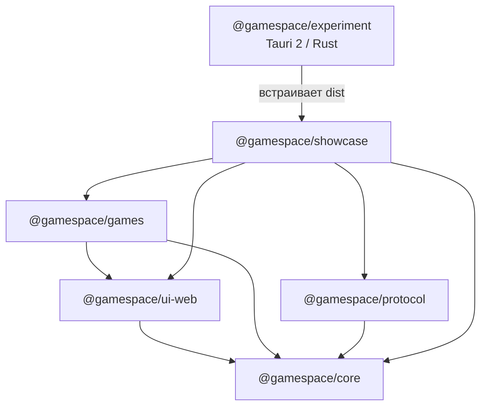
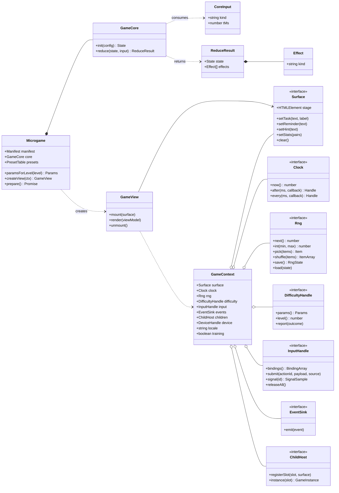
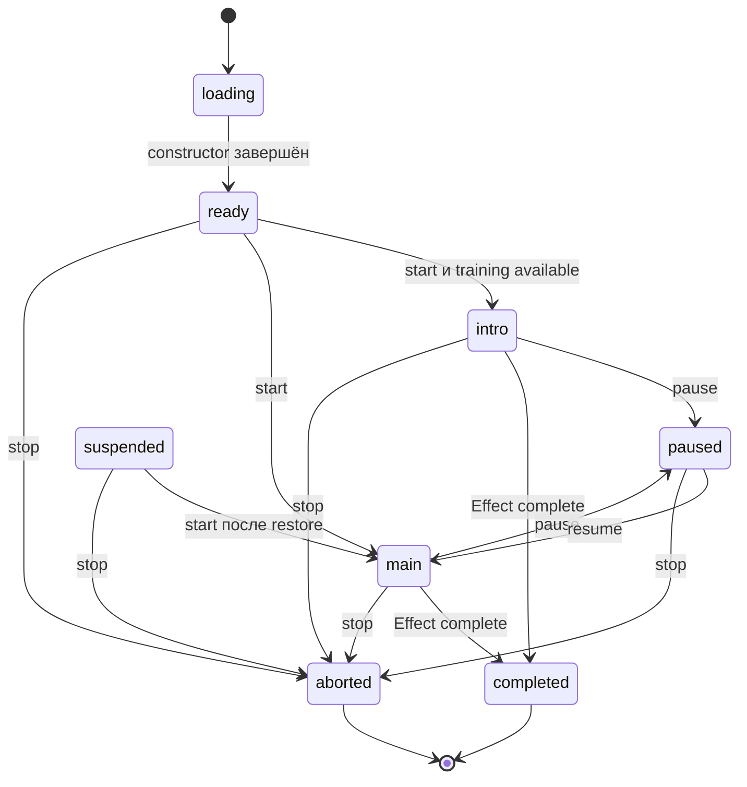
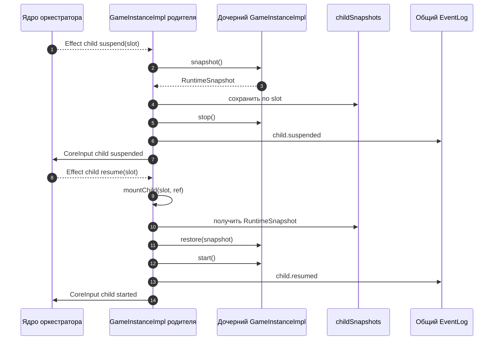
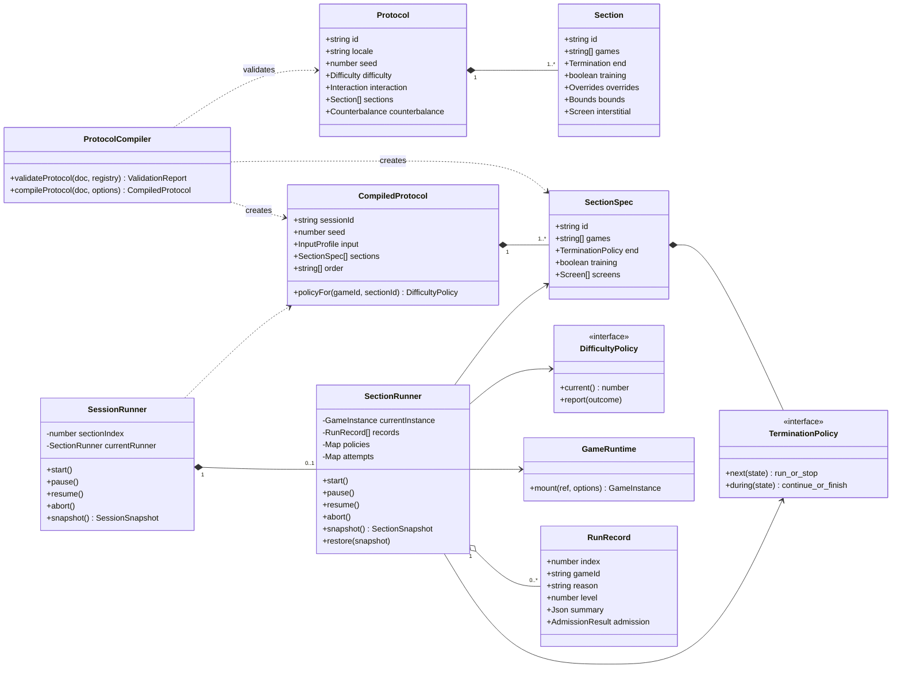
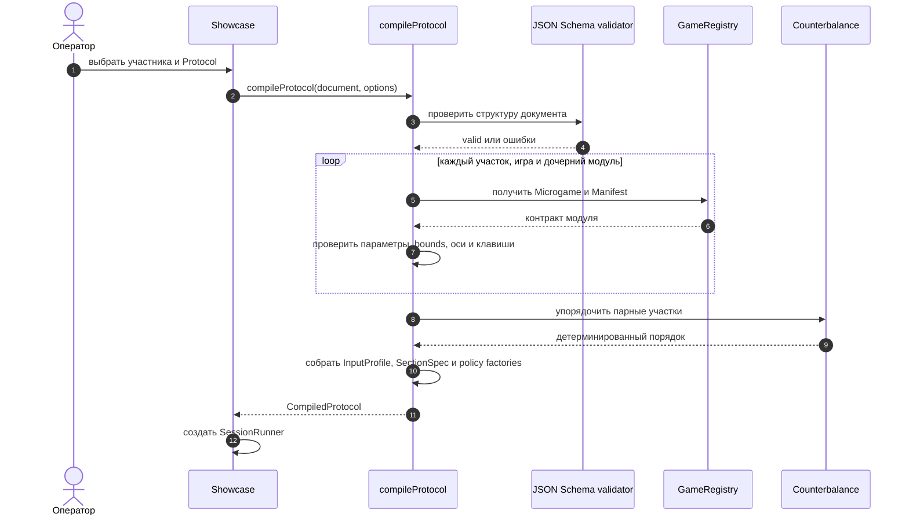
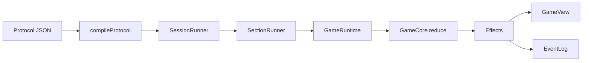
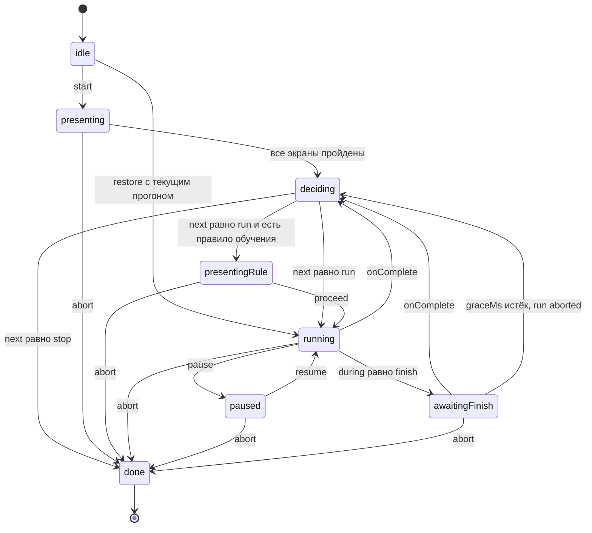

# Gamespace webdemo: актуальная архитектура

Этот документ описывает только текущий код
[`webdemo`](..). Источником истины служат пакеты, приложения, JSON
Schema и тесты внутри этого workspace.

## 1. Назначение системы

`webdemo` решает три связанные задачи:

1. предоставляет runtime и каталог когнитивных микроигр;
2. собирает и исполняет экспериментальные протоколы из этих микроигр;
3. запускает тот же интерфейс как веб-витрину или как лабораторное desktop-
   приложение с долговечной записью событий и LSL-маркерами.

В workspace находятся четыре пакета и два приложения:

- `packages/core` — контракты микроигры, runtime, ввод, сложность, журнал,
  маркеры, снимки и preflight;
- `packages/ui-web` — DOM-поверхность, клавиатурный адаптер и общие виджеты;
- `packages/games` — десять микроигр протокола;
- `packages/protocol` — схема протокола, компилятор и раннеры участков и сессии;
- `apps/showcase` — веб-витрина, конструктор и операторский интерфейс;
- `apps/experiment` — Tauri 2 host с файловым хранилищем и native LSL.

## 2. Границы зависимостей



Игровые ядра не импортируют хост, расписание или Tauri. `protocol` управляет
запусками через публичный API `core`, но не знает внутреннего состояния игр.
Desktop-приложение не создаёт отдельный frontend: оно собирает и встраивает
`apps/showcase/dist`.

Корневой `package.json` использует npm workspaces `packages/*` и `apps/*`.
Единственная runtime-зависимость корня вне workspace — `ajv`, используемый для
проверки JSON Schema.

## 3. Контракт микроигры

Публичные типы находятся в `packages/core/src/contracts.ts`.

Микроигра реализует `Microgame<S, VM>`:

- `manifest` — декларативное описание модуля;
- `core` — чистое ядро `GameCore<S>`;
- `paramsForLevel(level)` — параметры заданного уровня;
- `presets` — необязательная таблица осей сложности;
- `createView(ctx)` — фабрика представления;
- `prepare()` — необязательная асинхронная подготовка до запуска.

### 3.1. UML: статическая модель контракта



Главная граница контракта проходит между `GameCore` и `GameContext`.
`GameCore` получает только сериализуемые входы и возвращает данные; все
эффектные интерфейсы принадлежат runtime и представлению.

Ядро имеет две операции:

```ts
interface GameCore<S> {
  init(config: RunConfig): S;
  reduce(state: S, input: CoreInput): {
    state: S;
    effects: Effect[];
  };
}
```

Ядро не обращается к DOM, часам, случайности, устройствам или файловой системе.
Любое изменение состояния приходит как `CoreInput`, а внешнее действие
возвращается как `Effect`.

Входы ядра:

- переход жизненного цикла;
- дедлайн таймера;
- логическое действие участника;
- сэмпл сигнала;
- новые эффективные параметры;
- команда протокола;
- событие дочерней игры.

Эффекты ядра:

- отрисовать ViewModel;
- поставить или отменить таймер;
- записать доменное событие;
- сообщить исход пробы или блока;
- запросить параметры следующей пробы;
- завершить запуск со сводкой;
- выполнить команду дочерней игре;
- передать команду устройству через хост.

Контракты `signal` и `device` входят в API, но текущие десять микроигр их не
объявляют и не используют. `InputController.pushSignal()` уведомляет
подписчиков представления; автоматического преобразования сэмпла в
`CoreInput(kind: "signal")` в текущем runtime нет.

`GameView` получает только ViewModel и `GameContext`. Состояние игры остаётся в
ядре. DOM предоставляется через интерфейс `Surface`; браузерная реализация —
`DomSurface` из `packages/ui-web`.

### 3.2. UML: один проход входа через ядро

```mermaid
sequenceDiagram
  autonumber
  actor Participant as Участник или хост
  participant Input as InputController
  participant Instance as GameInstanceImpl
  participant Log as EventLog
  participant Core as GameCore
  participant Services as Runtime services
  participant View as GameView

  Participant->>Input: логическое действие
  Input->>Instance: apply(CoreInputBody)
  Instance->>Instance: добавить tMs и поставить в очередь
  Instance->>Log: append input
  Note over Instance,Log: вход записывается до изменения состояния
  Instance->>Core: reduce(state, CoreInput)
  Core-->>Instance: новое state + Effect[]

  loop каждый Effect по порядку
    alt render
      Instance->>View: render(viewModel)
    else schedule или cancel
      Instance->>Services: изменить таймер
    else emit
      Instance->>Log: append domain event
    else outcome
      Instance->>Services: обновить DifficultyController
    else child
      Instance->>Services: выполнить ChildCommand
    else complete
      Instance->>Log: append run.end
      Instance-->>Participant: onComplete(summary)
    end
  end
```

Reducer не вызывается повторно изнутри самого reducer. Если эффект порождает
новый вход, runtime снова помещает его в ту же приоритетную очередь.

## 4. Манифесты и пресеты

Структура манифеста задаётся
`packages/core/schema/manifest.schema.json`. TypeScript-типы генерируются в
`packages/core/src/manifest.types.ts`.

Манифест объявляет:

- идентификатор и версию модуля;
- совместимый диапазон runtime API;
- обязательные и необязательные capabilities;
- схему параметров и результата;
- действия, сигналы и способ адресации вариантов ответа;
- число уровней и монотонные оси;
- длину блока;
- обучение, текст правила и критерий допуска;
- возможность восстановления;
- дочерние модули оркестратора.

Preflight проверяет сам манифест и параметры запуска. Схемы доменных событий и
результата сейчас остаются декларативной метаинформацией: runtime не валидирует
каждое событие и итоговую сводку по этим схемам. Проверка ассетов также не
реализована.

Таблицы `presets.json` проходят отдельную схему
`packages/core/schema/presets.schema.json`. Каждая ось имеет роль:
`alternatives`, `speed`, `conflict`, `depth` или `duration`. Первые четыре
считаются осями нагрузки.

Если протокол закрепляет ось через override или сомкнутый диапазон, runtime:

1. исключает её из свободных осей;
2. применяет объявленную компенсационную кривую к оставшимся осям;
3. проверяет, что рост уровня всё ещё меняет нагрузку;
4. записывает `frozen` и `free` вместе с событием смены сложности.

## 5. Runtime запуска

`GameRuntime` владеет реестром, capabilities хоста, часами, приёмником событий,
общим счётчиком `seq` и диспетчером маркеров.

`GameRuntime.mount()` выполняет preflight и создаёт `GameInstanceImpl`.
Preflight проверяет:

- JSON Schema и версию манифеста;
- совместимость runtime API;
- обязательные capabilities;
- параметры запуска;
- наличие дочерних модулей;
- возможность восстановления там, где она нужна оркестратору.

Жизненный цикл экземпляра:



`blocked` и `outro` входят в тип `Phase`, но текущий `GameInstanceImpl` не
создаёт переходов в эти фазы.

Runtime, а не игра:

- назначает монотонное время входам;
- упорядочивает конкурентные входы;
- пишет вход в журнал до вызова `reduce`;
- исполняет эффекты;
- владеет таймерами;
- переключает фазы;
- маршрутизирует ввод активной дочерней игре;
- создаёт и восстанавливает снимки.

Очередь сортирует входы по фиксированному приоритету:
`lifecycle`, `protocol`, `params`, `deadline`, `action`, `child`, `signal`.
Внутри одного приоритета сохраняется порядок поступления.

## 6. Время, случайность и воспроизводимость

Игры получают часы и ГПСЧ через `GameContext`.

- `RealClock` используется в браузере и desktop-хосте;
- `VirtualClock` используется в headless-тестах;
- `SeededRng` имеет сериализуемое состояние;
- seed задаётся протоколом или детерминированно выводится из идентификаторов
  протокола и участника.

`RuntimeSnapshot` содержит:

- ссылку на пакет и фазу;
- сериализованное состояние ядра;
- курсор журнала;
- состояние ГПСЧ;
- оставшееся время дедлайнов;
- политику и уровень сложности;
- снимки дочерних задач.

При восстановлении runtime проверяет версию снимка и точное совпадение
идентификатора и версии микроигры. `GameInstanceImpl.restore()` восстанавливает
ядро, ГПСЧ, фазу, таймеры и детей, но не устанавливает сохранённый уровень
политики. На уровне расписания это делает `SectionRunner.restore()` для политик,
поддерживающих `set()`.

## 7. Журнал событий

Все записи имеют единый формат `LoggedEvent`:

- глобальный для сессии `seq`;
- `runId`;
- монотонное `tMs` и абсолютное `wallMs`;
- источник `input`, `domain` или `runtime`;
- необязательные `slot`, `sectionId`, `runIndex`;
- `type` и JSON `payload`.

Вход записывается до применения к ядру. Дочерние игры используют тот же журнал
и тот же счётчик, но получают `slot`.

Доступные приёмники:

- `MemorySink` — витрина и тесты;
- `LocalStorageSink` — браузерная буферизованная запись;
- `JsonlFileSink` — синхронная файловая запись через предоставленный fs API;
- desktop IPC — последовательная передача записей в Rust `SessionWriter`.

Текущий Showcase держит события браузерной сессии в памяти и экспортирует их
из экрана сводки. `localStorage` в Showcase используется для черновиков
протоколов, а не как обязательное хранилище журнала.

`EventLog` экспортирует JSONL и CSV. `inputsAfter()` извлекает входы после
курсора для детерминированного повтора.

## 8. Ввод

Игры объявляют логические действия в манифесте и не слушают клавиатуру напрямую.
`InputController` сопоставляет действия с `InputProfile`.

Есть два режима:

- `FREE_INPUT` — используются default bindings из манифеста;
- протокольный профиль — клавиши и политика pointer берутся из документа
  протокола.

Физическое положение буквенной клавиши определяется по `KeyboardEvent.code`,
поэтому раскладка ОС не меняет управление. Indexed-действие получает индекс
варианта, обычные действия получают клавиши слева направо. Удерживаемые действия
создают отдельные `down` и `up`; при потере фокуса runtime освобождает все
удержания.

`bindKeyboard` из `ui-web` — браузерный адаптер над `InputController`.

## 9. Сложность

В `core` реализованы четыре политики:

- `AdaptiveStaircase` — 2-up/1-down;
- `Monotonic` — только повышение после серии успешных исходов;
- `Manual` — уровень задаёт оператор;
- `Fixed` — неизменный уровень.

`DifficultyController` соединяет политику, пресеты, overrides и bounds.
Порядок применения параметров:

```text
параметры уровня → overrides → bounds
```

Обучающие исходы записываются, но получают `scored: false` и не изменяют
политику. Политику можно сменить во время запуска; текущий уровень при этом
сохраняется.

## 10. Дочерние игры и оркестраторы

Оркестратор управляет детьми эффектами `mount`, `start`, `stop`, `suspend`,
`resume`, `finish`, `unmount`.

Runtime:

- создаёт дочерние поверхности;
- наследует профиль ввода, signal source и настройки обучения;
- передаёт overrides, bounds и политику конкретной дочерней задачи;
- хранит уровень ребёнка между повторными появлениями;
- при `suspend` сохраняет снимок, а при `resume` создаёт экземпляр заново;
- возвращает события ребёнка в ядро родителя.

Так реализованы `adaptive-battery` и `interrupt-resume`. Хост направляет
клавиатуру через `activeInstance()` и не знает, какая задача вложена внутрь
оркестратора.

### 10.1. UML: suspend/resume дочерней игры



Родитель не читает снимок ребёнка. Он выражает намерение `suspend` или `resume`,
а сериализация и жизненный цикл остаются ответственностью runtime.

## 11. Каталог микроигр

`packages/games/src/index.ts` экспортирует `protocolGames`:

- `arithmetic` — арифметические задачи с вариантами ответа;
- `n-back` — рабочая память;
- `stroop` — подавление интерференции;
- `rule-switch` — переключение правил;
- `dual-load` — совмещение двух задач;
- `number-sequence` — зрительный поиск последовательности;
- `squash` — непрерывное управление площадкой на canvas;
- `baseline` — участок покоя с фиксацией и таймером;
- `adaptive-battery` — последовательность дочерних задач;
- `interrupt-resume` — основная задача с прерываниями и восстановлением.

Каждый модуль хранит рядом ядро, манифест и, если нужны, пресеты и
представление. Правила добавления модулей описаны в
[`packages/games/AUTHORING.md`](../packages/games/AUTHORING.md).

## 12. Документ протокола

Протокол — JSON-документ по схеме
`packages/protocol/schema/protocol.schema.json`. Сгенерированный тип находится
в `packages/protocol/src/protocol.types.ts`.

Документ задаёт:

- id, заголовок, locale и seed;
- профиль сложности;
- доступные клавиши и pointer policy;
- глобальные overrides и bounds;
- упорядоченный список участков;
- условие окончания каждого участка;
- обучение и тексты отбивок;
- пару участков для контрбалансировки;
- вводный, промежуточные и заключительный экраны.

Условие окончания может быть:

- по общему времени участка;
- по числу прогонов;
- по покрытию обучающих задач;
- по пределу одного прогона;
- по первому сработавшему условию из нескольких.

Актуальный лабораторный документ:
`packages/protocol/examples/reconnect-pilot.json`.

### 12.1. UML: статическая модель движка протокола



`Protocol` и `Section` — сериализуемые данные. `CompiledProtocol` — runtime-
представление с готовыми политиками и `SectionSpec`. `SessionRunner` отвечает
за порядок участков, `SectionRunner` — за повторы игр внутри одного участка,
`GameRuntime` — за один экземпляр микроигры.

## 13. Компиляция протокола

`compileProtocol()` выполняется до старта сессии.

Компилятор:

1. проверяет документ по JSON Schema;
2. проверяет уникальность участков и существование игр;
3. валидирует overrides, bounds, свободные оси и ёмкость клавиш для самой игры
   и её детей;
4. детерминированно применяет контрбалансировку по id протокола и участника;
5. строит профиль ввода;
6. объединяет глобальные и секционные настройки;
7. создаёт политики сложности;
8. превращает участки в `SectionSpec`;
9. вычисляет порядок и позиционные подписи экранов.

Результат `CompiledProtocol` содержит готовые участки, `sessionId`, seed,
профиль ввода, итоговый порядок, outro и фабрику политик.

### 13.1. UML: компиляция до запуска



Ошибки схемы или семантики завершают компиляцию; `SessionRunner` не создаётся
для частично корректного документа.

## 14. Исполнение участка и сессии



### 14.1. UML: нормальный проход сессии

```mermaid
sequenceDiagram
  autonumber
  actor Operator as Оператор
  participant Session as SessionRunner
  participant Section as SectionRunner
  participant End as TerminationPolicy
  participant Runtime as GameRuntime
  participant Game as GameInstanceImpl

  Operator->>Session: start()

  loop участки в скомпилированном порядке
    Session->>Section: создать и start()
    Section-->>Operator: present(screen, proceed)
    Operator->>Section: proceed()
    Section->>Section: section.start и запуск ticker
    Section->>End: next(SeriesState)

    loop пока next возвращает run
      End-->>Section: run
      Section->>Runtime: mount(gameId, run options)
      Runtime-->>Section: GameInstanceImpl
      Section->>Game: start()

      alt игра завершает блок сама
        Game-->>Section: onComplete(summary)
      else ticker получает finish
        Section->>End: during(SeriesState)
        End-->>Section: finish
        Section->>Game: protocol(finish)
        Game-->>Section: onComplete(partial summary)
      end

      Section->>Section: RunRecord и admission
      Section->>Game: stop()
      Section->>End: next(SeriesState)
    end

    End-->>Section: stop
    Section-->>Session: onDone(records)
  end

  Session-->>Operator: onDone()
```

Если игра не отвечает на `protocol(finish)` за `graceMs`, раннер закрывает
прогон со сводкой `null` и причиной `aborted`, после чего применяет обычное
решение `next()`.

`SessionRunner` последовательно запускает участки и сохраняет общую политику
сложности задачи между участками. Он умеет создать `SessionSnapshot`, но
session-level метода `restore()` сейчас нет; восстановление реализовано у
`SectionRunner`.

`SectionRunner`:

- показывает отбивки до начала отсчёта;
- запускает одну игру или ротацию игр;
- поддерживает уровни между прогонами;
- завершает временной блок командой `protocol.finish`, позволяя игре вернуть
  частичную сводку;
- применяет grace period, после которого незакрывшийся блок помечается aborted;
- считает критерий допуска обучения по исходам;
- умеет pause, resume и аварийное завершение;
- создаёт снимок текущего участка и восстанавливает незавершённый прогон.

Участок обучения с `coverage` выбирает задачу с наименьшим числом попыток среди
ещё не пройденных. Задача считается закрытой после выполнения admission-
критерия либо после исчерпания `maxAttempts`.

### 14.2. UML: состояния `SectionRunner`

Это логические состояния, выводимые из полей раннера; отдельного enum для них в
коде нет.



## 15. Маркеры

Маркеры — проекция подмножества журнала. `DEFAULT_CODEBOOK` содержит:

- `section.start` / `section.end`;
- `run.start` / `run.end`;
- `interruption.start` / `interruption.end`;
- `resume`.

Стимулы, ответы, исходы и изменения сложности остаются в полном журнале, но не
публикуются как LSL-маркеры.

В браузере используется `MarkerDispatcher` с `NullMarkerSink`. В desktop-
приложении тот же codebook передаётся Rust backend; `SessionWriter` по типу
каждой записи публикует числовой marker и сохраняет результат отправки.

## 16. Showcase

`apps/showcase` — Vite-приложение на TypeScript и DOM. Dev-сервер закреплён на
`http://localhost:5199`.

Интерфейс имеет три вкладки:

- «Сценарий» — выбор участника, протокола, темпа и запуск полной сессии;
- «Конструктор» — визуальное редактирование JSON-протокола;
- «Отладка модуля» — одиночный запуск микроигры с ручным управлением
  сложностью.

Во время сессии setup скрывается, а участнику остаётся игровая поверхность.
После завершения показывается сводка и доступны экспорты журнала.

Режим «репетиция» компилирует тот же документ, но передаёт операторские
длительности участков. Компилятор одновременно ограничивает собственный
временной параметр игры, чтобы экран, игра и расписание завершались согласованно.

## 17. Конструктор

Конструктор находится в `apps/showcase/src/builder.ts` и редактирует сам
`Protocol`, без промежуточной модели.

Поддерживаемые типы блоков:

- baseline;
- training;
- game;
- pause;
- micro pause.

Конструктор редактирует:

- порядок, названия и состав участков;
- длительности и комбинированные условия завершения;
- тексты экранов;
- политику и диапазоны сложности;
- overrides и bounds каждой игры и дочерней задачи;
- состав оркестраторов;
- клавиши протокола;
- контрбалансировку.

После изменений документ проверяется тем же `validateProtocol()`, который
защищает реальный запуск. При изменении ёмкости клавиш конструктор сужает
соответствующие bounds вариантов ответа. При переименовании или удалении
участка обновляется либо снимается контрбалансировка.

В браузере черновики хранятся в `localStorage` под ключом
`gamespace.protocols`. В desktop-режиме они сохраняются как JSON-файлы в
portable-каталоге `protocols/`.

## 18. Desktop-приложение

`apps/experiment` — Tauri 2 приложение. Renderer — сборка Showcase в режиме
`experiment`; backend написан на Rust.

Frontend-адаптер `apps/showcase/src/desktop.ts`:

- определяет наличие Tauri IPC;
- загружает portable-конфигурацию и протоколы;
- запускает LSL preflight;
- создаёт сессию;
- последовательно отправляет события;
- flush-ит, завершает или аварийно закрывает запись;
- читает разрешённые файлы последней сессии;
- открывает каталог сессии.

Ошибки startup, runtime и IPC отправляются командой `report_error`.
`apps/showcase/src/entry.ts` показывает отдельный экран, если renderer не смог
загрузиться.

Rust-команды объявлены в `apps/experiment/src-tauri/src/lib.rs`:
`bootstrap`, операции с протоколами, LSL preflight/status, lifecycle сессии,
чтение разрешённых файлов, открытие каталога и запись диагностики.

Tauri renderer получает только capability `core:default`. CSP ограничивает
источники самим приложением, asset/custom protocol и IPC; inline-стили и
WebAssembly/eval разрешены явно конфигурацией приложения.

## 19. Portable-хранилище

В debug-режиме portable root:
`apps/experiment/portable/`. В release он располагается рядом с executable или
`.app`.

Bootstrap:

1. создаёт `protocols/` и `data/`;
2. при отсутствии копирует встроенный `reconnect-pilot.json`;
3. проверяет запись и `fsync`;
4. загружает JSON-протоколы;
5. помечает незакрытые сессии со статусом `running` как `interrupted`.

Сессия создаётся в:

```text
data/<participant>/<UTC>_<protocol>_<uuid>/
```

Файлы сессии:

- `protocol.json` — точная копия запущенного документа;
- `session.json` — manifest, статусы, версии, seed, порядок и счётчики;
- `events.jsonl` — журнал, дописываемый во время работы;
- `events.csv` — финальный табличный экспорт;
- `markers.csv` — отправленные и неотправленные LSL-маркеры;
- `codebook.csv` — версия и расшифровка кодов;
- `summary.json` — итог сессии.

`session.json` содержит SHA-256 протокола. `SessionWriter` отвергает события без
возрастающего `seq` и запросы с токеном другой сессии.

Записи синхронизируются на маркере, на событии `*.end` или после двадцати
накопленных событий. Завершение и abort делают финальный flush и обновляют
статус. Диагностика приложения пишется отдельно в `diagnostics.jsonl`.

## 20. Native LSL

`apps/experiment/src-tauri/src/lsl.rs` держит liblsl в отдельном worker thread.

Перед сессией выполняется настоящий outlet → discovery → inlet loopback с
контрольным значением. После успешного self-test создаётся поток:

- name: `Reconnect Markers`;
- type: `Markers`;
- один канал `int32`;
- irregular rate;
- уникальный `source_id` для участника и протокола.

Публикация возвращает `sent`, LSL timestamp и текст ошибки. Эти данные
попадают в `markers.csv`. В текущей macOS-сборке подтверждение видимости в
LabRecorder рекомендательное (`VITE_LABRECORDER_REQUIRED=false`); Windows
portable требует его перед запуском.

## 21. Безопасное завершение desktop-сессии

Frontend поддерживает операторские команды:

- `Ctrl+Shift+Space` — pause/resume;
- `Ctrl+Shift+End` — аварийное завершение.

При активной сессии close/exit в Rust закрывает writer как `aborted`. На Windows
закрытие окна требует явного подтверждения. Panic hook и lifecycle Tauri
фиксируются в `diagnostics.jsonl`.

Windows release до запуска проверяет:

- доступность portable root для записи;
- наличие fixed WebView2 runtime;
- права AppContainer на каталог runtime.

## 22. Сборка и поставка

Основные команды:

```bash
npm ci
npm run dev
npm test
npm run typecheck
npm run build
npm run experiment:dev
npm run experiment:test
npm run experiment:build
npm run experiment:build:windows
```

`npm run build` создаёт `apps/showcase/dist`.

GitHub Pages workflow выполняет `npm ci`, typecheck, Vitest и build, затем
публикует `apps/showcase/dist`.

Firebase Hosting использует тот же dist. Deploy запускается вручную и только
при наличии `GCP_WIF_PROVIDER` и `GCP_DEPLOY_SA`; авторизация идёт через OIDC
Workload Identity Federation.

Windows workflow:

1. устанавливает Node и Rust;
2. выполняет typecheck и Vitest;
3. собирает renderer в режиме `experiment`;
4. запускает Rust-тесты, включая native LSL loopback;
5. собирает release executable;
6. добавляет fixed WebView2 и пилотный протокол;
7. запускает packaged self-test;
8. публикует portable ZIP как artifact.

## 23. Проверки архитектурных инвариантов

Vitest проверяет:

- соответствие всех микроигр общему контракту;
- детерминизм seed и виртуального времени;
- схемы манифестов, протоколов и пресетов;
- монотонность и компенсацию осей сложности;
- клавиатурные профили и физические клавиши;
- вложенные игры, suspend/resume и оркестрацию;
- критерии допуска обучения;
- условия завершения участков;
- контрбалансировку и компиляцию протокола;
- checkpoint/replay и восстановление;
- поведение конструктора и операторского интерфейса;
- длинные headless-сессии;
- границы workspace.

Rust-тесты проверяют portable storage, атомарную запись, статусы незавершённых
сессий, порядок событий, CSV-экспорт и native LSL loopback.

`tests/project-boundary.test.ts` фиксирует актуальную границу проекта: в
`webdemo` допустимы только платформенные пакеты, Showcase и Experiment.

## 24. Где менять систему

- контракт и runtime: `packages/core/src/`;
- схема манифеста: `packages/core/schema/manifest.schema.json`;
- микроигры: `packages/games/src/`;
- правила авторства: `packages/games/AUTHORING.md`;
- схема протокола: `packages/protocol/schema/protocol.schema.json`;
- компилятор: `packages/protocol/src/compile.ts`;
- раннер участка: `packages/protocol/src/runner.ts`;
- раннер сессии: `packages/protocol/src/session.ts`;
- Showcase: `apps/showcase/src/main.ts`;
- конструктор: `apps/showcase/src/builder.ts`;
- frontend desktop bridge: `apps/showcase/src/desktop.ts`;
- Tauri commands и lifecycle: `apps/experiment/src-tauri/src/lib.rs`;
- durable storage: `apps/experiment/src-tauri/src/storage.rs`;
- LSL worker: `apps/experiment/src-tauri/src/lsl.rs`;
- CI и deploy: `.github/workflows/`.
